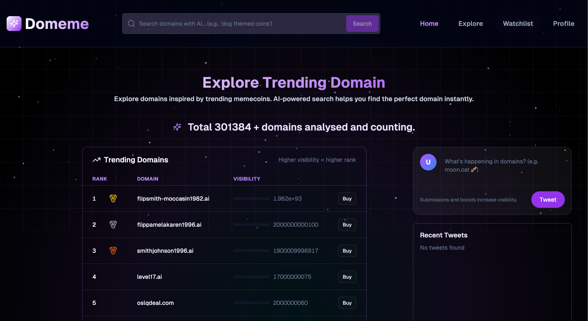
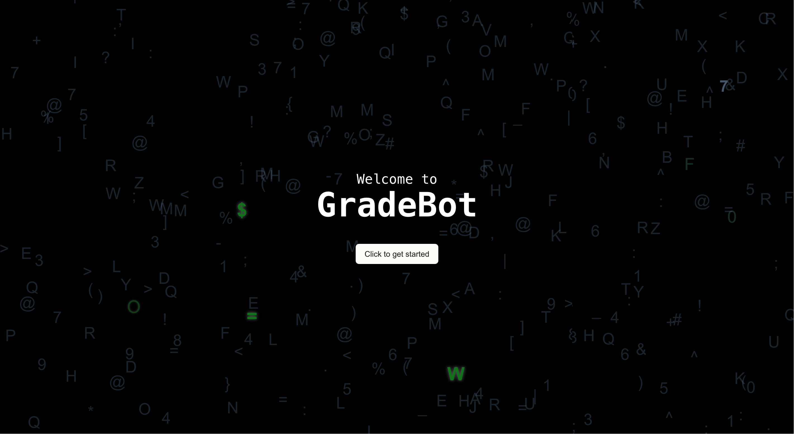
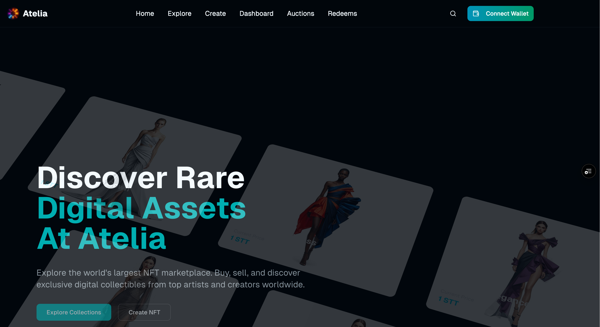

# Hi, I’m Aparna Singh 👋

> I build frontend systems that teams can trust, scale, and extend.

Frontend Developer | React • Next.js • TypeScript | Web3 & AI Products

I enjoy working with startups and founders to turn ideas into **clean, scalable, production-ready web apps**.
1+ year experience building real products at a Web3 startup.

---

## 🚀 What I Do Best
- ⚡ Build fast, responsive UIs using **React, Next.js & TypeScript**
- 🎨 Clean UI with **Shadcn + Tailwind**
- 🔗 Web3 integrations (wallets, smart contracts, Cosmos ecosystem)
- 🤖 AI-powered features using modern APIs (Gemini)
- 🧠 Strong product mindset — not just “UI”, but usability

---

## 🏆 Real Projects

### 🔹 Vintage Vault (Web3 Product)
Fractional ownership of luxury assets (cars, watches, wines)  
✔ On-chain tracking  
✔ Wallet integrations  
✔ Production-grade UI  

> Built at **Andromeda Protocol**

---

### 🔹 Token Factory (Web3 Product)
Tool to deploy CW20 tokens & add liquidity on Cosmos DEXs  
✔ Astroport, Osmosis  
✔ For user with no technical knowledge 

> Built at **Andromeda Protocol**

---

### 🔹 Legacy App (Scalable Frontend Architecture)
A long-term **legacy-focused application** built to demonstrate how I design
frontend codebases meant to be **maintained, extended, and scaled over time**.

✔ Clean folder & component structure  
✔ Strong TypeScript typing  
✔ Predictable state flow  
✔ Built for teams & handovers  

📂 Repo: https://github.com/bytesaparna/legacy
👉 Live: https://legacy-lit.vercel.app/

[]

---

### 🔹 Domeme (AI + Crypto Platform)

Domeme is a platform that combines meme culture, crypto signals, and AI to
identify and surface emerging domain name trends before they go mainstream.

✔ AI-assisted trend discovery  
✔ Community-driven submissions  
✔ Built with a focus on scalability and experimentation  

📂 Repo: https://github.com/bytesaparna/domeme  
🔗 Live: https://domeme.vercel.app/

[]

### 🔹 Somnia Mines Game   (Web3 Product)
🎮 Decentralized Mines Game  
🔗 Wallet connection  
🏆 On-chain rewards  

📂 Repo: https://github.com/bytesaparna/somnia-mines  
👉 Live: https://somnia-mines.vercel.app/

[]

---

### 🔹 Zen Todo (AI Powered)
📝 Full-stack task management app  
🤖 Natural language AI assistant for productivity  

📂 Repo: https://github.com/bytesaparna/zen-todo  
👉 Live: https://zen-todo-liard.vercel.app/

---

### 🔹 GradeBot
✍️ AI-powered essay grading using Gemini API  
📊 Detailed feedback on content, structure, and language  

📂 Repo: https://github.com/bytesaparna/gradebot  
👉 Live: https://gradebot.vercel.app/

[]

---

### 🔹 Atelia (SaaS / Product Platform)  (Web3 Product)
A modern frontend application focused on **clean UX, scalability, and real-world product workflows**.

✔ Production-style architecture  
✔ Thoughtful UI/UX decisions  
✔ Built for extensibility and long-term use  

📂 Repo: https://github.com/bytesaparna/atelia  

[]

---

## 🧰 Tech Stack
**Frontend:** React, Next.js, C++, JavaScript, TypeScript  
**UI:** Tailwind, Shadcn  
**Web3:** Wallets, Smart Contracts, Cosmos  
**AI:** Gemini API, AI tooling  

---

## 📬 Hire Me
If you need:
- A reliable frontend developer
- Someone who understands products, not just components
- Clean, maintainable code with great UI

📩 Email: aparnasingh1724@gmail.com  
🔗 Portfolio: https://bytesaparna-portfolio.vercel.app/
